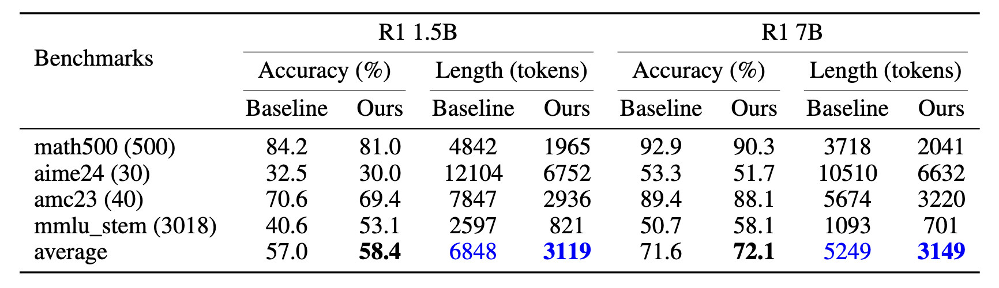
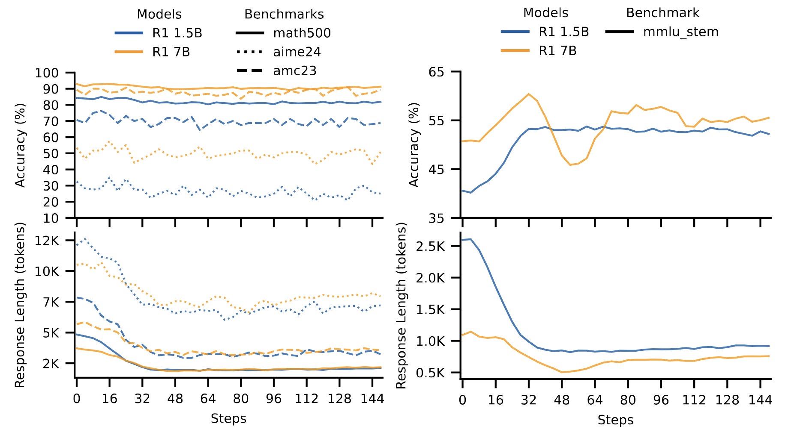

<div align="center">

# Concise Reasoning via Reinforcement Learning

[](https://arxiv.org/abs/2504.05185) [](https://wand.ai/blog/from-prolixity-to-concise-reasoning)

</div>

This repository hosts the code release for the paper:

> [Concise Reasoning via Reinforcement Learning](https://arxiv.org/abs/2504.05185)

Despite significant advancements in large language models (LLMs), **a major drawback of reasoning models is their enormous token usage**, which increases computational cost, resource requirements, and response time. 

In this work, we revisit the core principles of reinforcement learning (RL) and, through mathematical analysis, demonstrate that the tendency to generate lengthy responses arises inherently from RL-based optimization during training. 

We show that introducing **a secondary phase of RL post-training**, using a **small set of problems** and limited resources, can significantly reduce a model's chain of thought while maintaining or even enhancing accuracy. This finding challenges the prevailing assumption that longer responses inherently improve reasoning accuracy. Instead, we uncover a natural correlation between conciseness and accuracy that has been largely overlooked. 

This repository provides the codebase to validate our conclusions, also to reproduce the results presented in the paper.

> Comparison of R1 1.5B and R1 7B, and their post-trained versions on various benchmarks:

<div align="center">
    
</div>

> Response dynamics of two base models, DeepSeek-R1-Distill-Qwen-1.5B (blue) and DeepSeek-R1-Distill-Qwen-7B (orange). Both models are trained with 8 problems from the level-5 subset of MATH dataset. Left: three mathematics benchmarks (different line styles). Right: STEM subset of the MMLU dataset. The dataset include 3018 problems derived from various stem domains such as biology, physics, computer science, and electrical engineering. Response length and accuracy are shown against training checkpoints (steps). Response length decreased significantly, while accuracy remained stable or improved across benchmarks and model sizes:

<div align="center">
    
</div>


## News
- **[2025/04/14]** We release the training/eval code and our paper. 


## Quick Start

### Installation

Our code is implemented based on a heavily modified fork of [OpenRLHF](https://github.com/OpenRLHF/OpenRLHF). Some changes are from [SimpleRL](https://github.com/hkust-nlp/simpleRL-reason/tree/v0). 

To start, you first need to do the installations. 

1. Clone the repo:
```
git clone https://github.com/ai-wand/concise-reasoning
cd concise-reasoning
```

2. Set up an environment. If you do not use conda, you can do the following:

```
pip install --upgrade pip
pip install virtualenv
python -m venv rlproject
source rlproject/bin/activate
```
3. Install requirements and the codebase:
```
cd train
pip install -e .
```

### NOTE 
OpenRLHF utilizes a complex structure with a deep hierarchy and numerous class dependencies. To make the code more understandable, we have removed and simplified several files and classes in this repo. 

Moreover, since we have started this project, OpenRLHF has evolved significantly. the code here is based on an older version of OpenRLHF. We plan to provide codebase for the new OpenRLHF and with minimal intervensions to also facilitate transitioning to other codebases.

### Reproducing Results
The minimum hardware requirement for training is 6 H/A100-80G GPUs.

1. Launch the ray cluster using the command below:
```bash
ray start --head --node-ip-address 0.0.0.0 --num-gpus 8
```

2. Submit the training job (make sure you are in the `train` folder):

> For `DeepSeek-R1-Distill-Qwen-1.5B` base-model on MATH data (8 problems):
```bash
ray job submit --address="http://127.0.0.1:8265" -- /bin/bash examples/script/R1_on_math.sh
```

> For `Qwen2.5-Math-7B base-model` on MATH data (8 problems):
```bash
ray job submit --address="http://127.0.0.1:8265" -- /bin/bash examples/script/qwen_on_math.sh
```

> For arbitrary runs, simply make a new `.sh` file similar to `examples/script/R1_on_math.sh` and set the args accordingly.


### Evaluate

We used [Qwen Math's codebase](https://github.com/QwenLM/Qwen2.5-Math/tree/main/evaluation) for evaluation. To evaluate the checkpoints saved during training go to the `eval` folder and run `eval/eval.py` with the appropriate arguments.

Here is an example of running `eval/eval.py` on checkpoints saved in `train/checkpoints/R1_on_math`:
> python eval.py \
  --checkpoint_folder ../train/checkpoints/R1_on_math/_actor \
  --pretrain deepseek-ai/DeepSeek-R1-Distill-Qwen-1.5B \
  --num_gpus 8 \
  --num_processes 30 \
  --data_names math500,aime24,amc23 \
  --prompt_type r1-cot \
  --n_sampling 4 \
  --temperature 0.6 \
  --max_tokens_per_call 32768 \
  --top_p 0.95

Training logs are tracked via Weights & Biases (wandb) and can be accessed through the project dashboard.

For replicating Figure 2 and 3 from the paper, use the `stats/plots.ipynb` notebook.
## Citation

If you find this blog or our code useful, we would appreciate it if you could cite our work:

```bibtex
@misc{fatemi2025concrsn,
      title={Concise Reasoning via Reinforcement Learning}, 
      author={Mehdi Fatemi and Banafsheh Rafiee and Mingjie Tang and Kartik Talamadupula},
      year={2025},
      eprint={2504.05185},
      archivePrefix={arXiv},
      primaryClass={cs.CL},
      url={https://arxiv.org/abs/2504.05185}, 
}
```

## License Notice
Only the following folder is subject to the Apache License, Version 2.0.

`./train/openrlhf`

The rest of this project, including `./eval` and `./stats`, is licensed under the MIT License — https://opensource.org/licenses/MIT.

Please see the [NOTICE file](./NOTICE.txt) for details.

## Acknowledgement
We implement our reinforcement learning algorithm extending from [OpenRLHF](https://github.com/OpenRLHF/OpenRLHF). We use [vLLM](https://github.com/vllm-project/vllm). The evaluation scripts are based on [Qwen2.5-Math](https://github.com/QwenLM/Qwen2.5-Math/tree/main/evaluation). 


